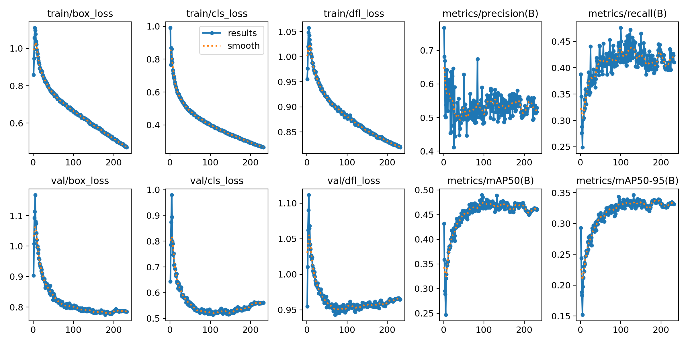

# 🏙️ Urban Object Detection — Cityscapes Dataset

> Real-time urban scene understanding using **YOLOv12** trained on the **Cityscapes Dataset**

---

## 📌 Project Overview

This project focuses on detecting and localizing urban objects in street-level images using the YOLOv12 object detection architecture. The model is trained on the Cityscapes dataset, which consists of high-resolution images captured from moving vehicles across 50+ cities.

---

## 🗂️ Repository Structure

```
urban-object-detection-cityscapes/
├── data.yaml            # Dataset configuration (classes, paths)
├── main.ipynb           # Training, evaluation & inference notebook
├── requirements.txt     # Python dependencies
├── results.png          # Training metrics graph
├── weights/
│   └── best.pt          # Best trained model weights
└── README.md
```

---

## 📦 Dataset

- **Name:** [Cityscapes Dataset](https://www.cityscapes-dataset.com/)
- **Images:** High-resolution urban street scenes (2048×1024)
- **Source:** 50+ cities across Germany and neighboring countries
- **Classes Detected:**

| ID | Class |
|----|-------|
| 0 | Person |
| 1 | Rider |
| 2 | Car |
| 3 | Truck |
| 4 | Bus |
| 5 | Motorcycle |
| 6 | Bicycle |
| 7 | Traffic Light |

> Update the table above based on your `data.yaml` class list.

---

## 🧠 Model

| Property | Details |
|----------|---------|
| Architecture | YOLOv12 |
| Input Size | 640×640 |
| Framework | PyTorch / Ultralytics |
| Weights | `weights/best.pt` |

---

## 📊 Results

| Metric | Value |
|--------|-------|
| mAP@0.5 | **0.490** |
| mAP@0.5:0.95 | **0.330** |
| Precision | **~0.55** |
| Recall | **~0.42** |
| Epochs Trained | 250 |

> Training and validation losses converged steadily over 250 epochs with no signs of overfitting.



---

## 🚀 Getting Started

### 1. Clone the Repository
```bash
git clone https://github.com/YOUR_USERNAME/urban-object-detection-cityscapes.git
cd urban-object-detection-cityscapes
```

### 2. Install Dependencies
```bash
pip install -r requirements.txt
```

### 3. Run Inference
```python
from ultralytics import YOLO

model = YOLO("weights/best.pt")
results = model.predict(source="your_image.jpg", conf=0.25)
results[0].show()
```

### 4. Full Training & Evaluation
Open and run `main.ipynb` step by step.

---

## 🛠️ Tech Stack

- **Python 3.10+**
- **YOLOv12 (Ultralytics)**
- **PyTorch**
- **OpenCV**
- **Jupyter Notebook**

---

## 📁 data.yaml Structure

```yaml
path: ./data
train: images/train
val: images/val

nc: 8  # number of classes
names: ['person', 'rider', 'car', 'truck', 'bus', 'motorcycle', 'bicycle', 'traffic light']
```

---

## 👤 Author

**Chandra Prakash Maurya**
- 🔗 [LinkedIn](https://www.linkedin.com/in/mauryachandraprakash)
- 💻 [GitHub](https://github.com/ChandraPrakash-123)

---

## 📄 License

This project is licensed under the MIT License.

---

⭐ If you found this project useful, consider giving it a star!
